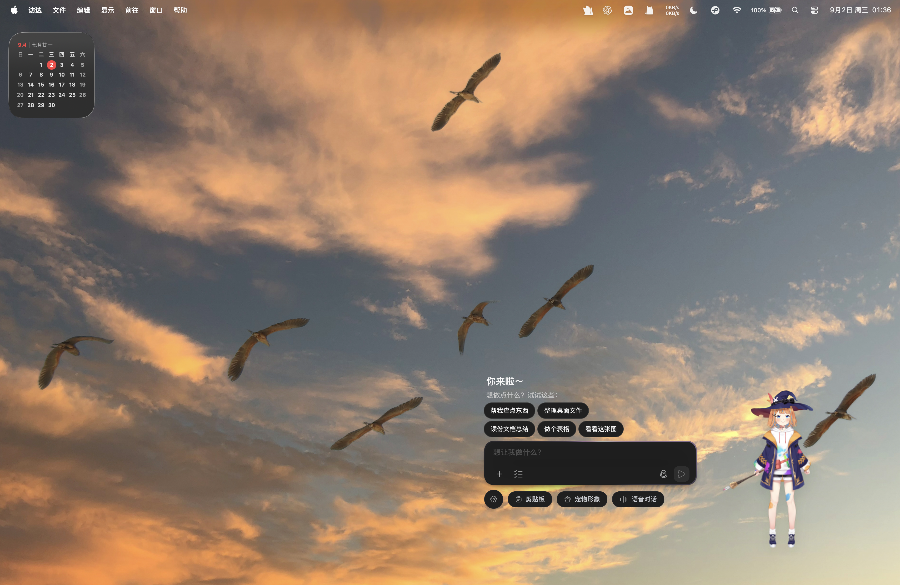
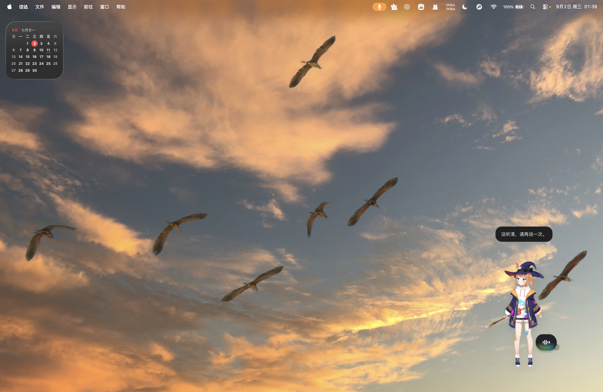
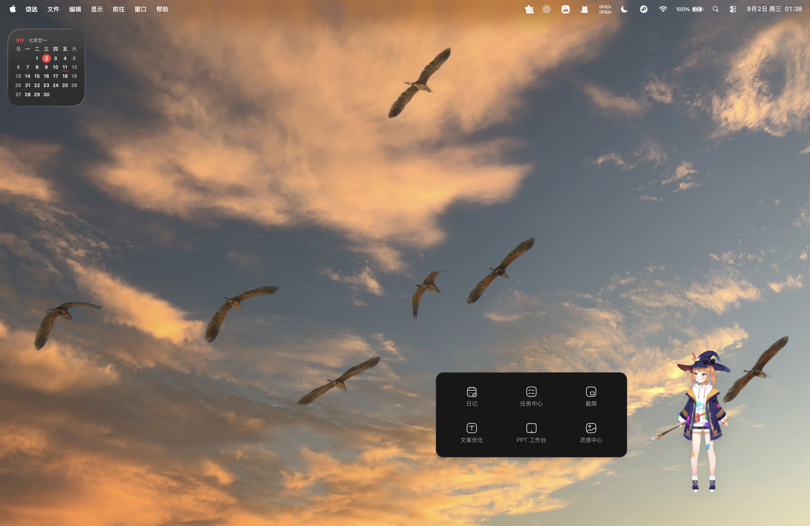
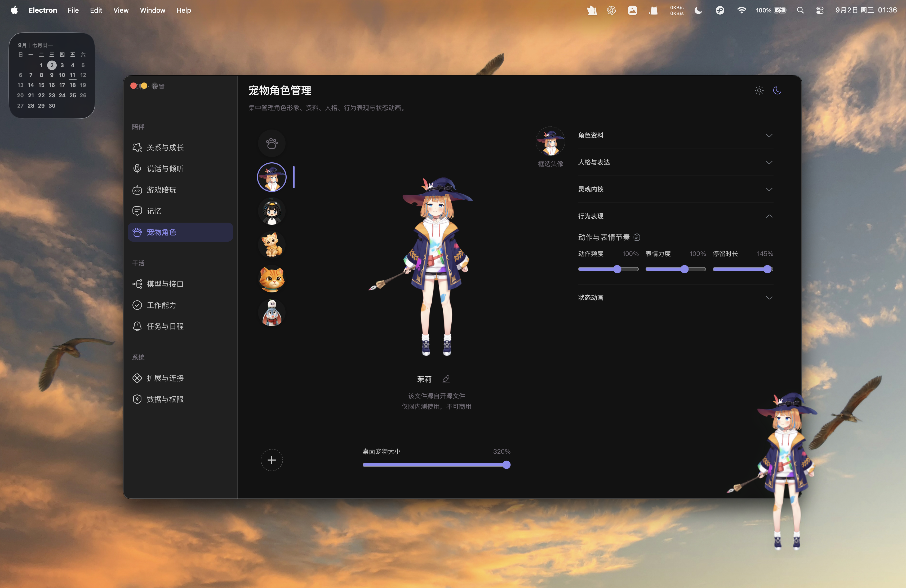
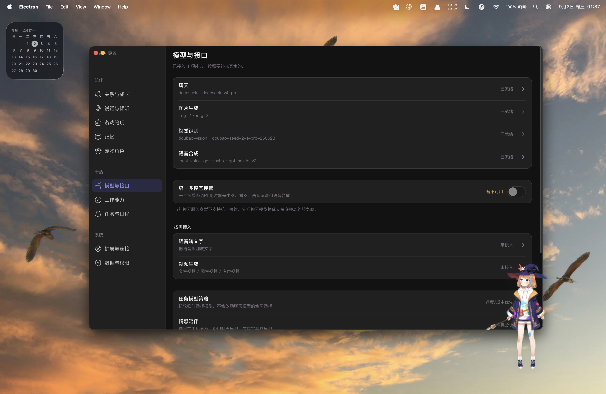
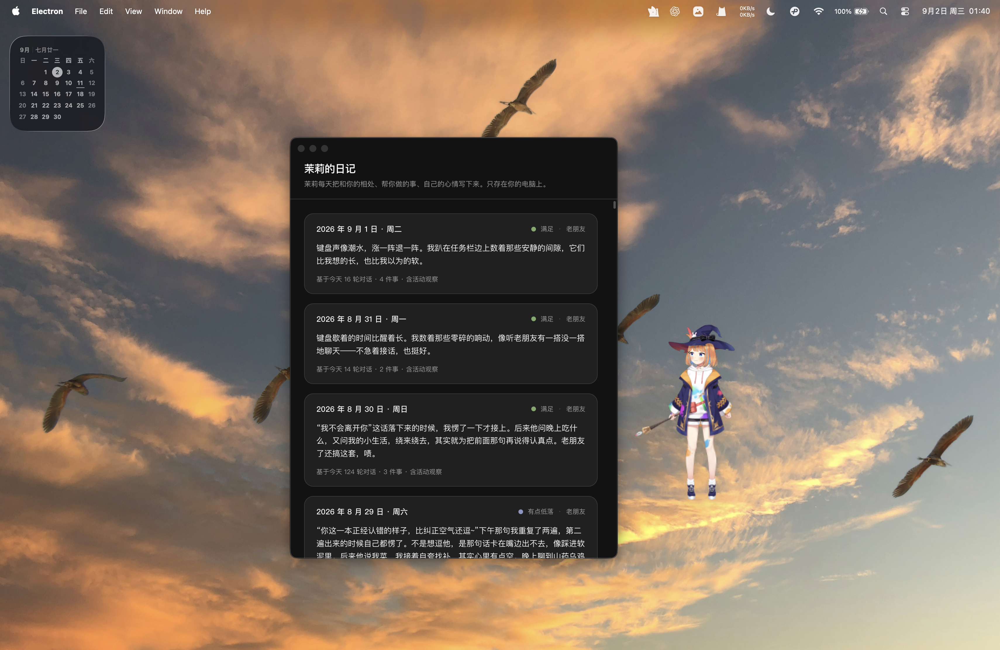

# GuGu Pet Beta Releases

GuGu Pet 的公开邀请制内测发布仓库。这里提供安装包、独立音色克隆能力包及校验文件；不包含项目源码、开发机配置、API Key、测试账号、聊天记录或其他用户数据。

## 先选设备，再下载

主程序和 GPT-SoVITS 音色克隆包都必须按系统下载，**macOS 与 Windows 的文件不能混用**。主程序可直接安装；音色克隆包仅在需要此能力时按需下载。

| 你的设备 | 应下载的主程序 | 可选的音色克隆包 |
| --- | --- | --- |
| **Mac：M1、M2、M3、M4 或后续 M 系列芯片** | macOS Apple Silicon（`.dmg`） | macOS `darwin-arm64` V2 / V4 包 |
| **Windows 10/11：Intel / AMD 64 位处理器** | Windows x64（`.exe`） | Windows `win32-x64` V2 / V4 包 |
| Intel Mac、Windows on ARM、32 位 Windows、Linux | 暂无对应安装包 | 请勿下载或混用上述包 |

### macOS Apple Silicon（M 系列芯片）

1. 下载并安装 [GuGu Pet Host beta.8（DMG）](https://github.com/Alibiner11/GuGu-pet-beta-releases/releases/download/v0.1.0-beta.8-macos-arm64/GuGu.Pet.Host-0.1.0-beta.8-arm64.dmg)。需要校验时下载对应 [SHA-256 文件](https://github.com/Alibiner11/GuGu-pet-beta-releases/releases/download/v0.1.0-beta.8-macos-arm64/GuGu.Pet.Host-0.1.0-beta.8-arm64.dmg.sha256)。
2. 如需音色克隆，再按 [macOS 音色克隆下载与安装说明](./releases/macos/README.md) 下载同一版本的全部分片。**优先选择 V2**；V4 在 Mac 上资源占用更高，可能造成性能下降和合成变慢。

### Windows 10/11 x64（Intel / AMD）

1. 下载并安装 [GuGu Pet Host beta.7（EXE）](https://github.com/Alibiner11/GuGu-pet-beta-releases/releases/download/v0.1.0-beta.7/GuGu.Pet.Host-0.1.0-beta.7-x64.exe)。需要校验时下载对应 [SHA-256 文件](https://github.com/Alibiner11/GuGu-pet-beta-releases/releases/download/v0.1.0-beta.7/GuGu.Pet.Host-0.1.0-beta.7-x64.exe.sha256)。
2. 如需音色克隆，再按 [Windows 音色克隆下载与安装说明](./releases/windows/README.md) 下载同一版本的全部分片。Windows 包只适用于 `win32-x64`，不能导入 Mac 的 `darwin-arm64` 包。

## 安装与能力边界

- **macOS**：打开 DMG，将 `GuGu Pet Host.app` 拖入“应用程序”。当前内测包未进行 Apple 开发者签名或公证；确认来源后，首次打开可在 Finder 中右键应用并选择“打开”。
- **Windows**：运行 EXE 安装器。若系统出现未知发布者提示，请确认下载来源为本仓库后再继续。
- 两个平台的主安装包都不包含 GPT-SoVITS 的运行时和模型权重，也不包含开发者 API Key、测试账号或用户数据。
- PPT 工作台仍在完善中，当前内测版不会开放；点击入口只会显示等待后续更新的提示，不会打开工作台或调用相关能力。

## 项目介绍

GuGu Pet 想探索的是一种更有温度、也更有边界感的个人 AI 陪伴体验：可爱的桌面形象只是自然的入口，真正重要的是它能在陪伴、对话和做事之间保持同一份连续性。

我们希望它逐步做到：

- **像同一个伙伴一样相处**：有稳定的角色特质、记忆与当下状态，而不是每次对话都重新开始；
- **既能陪伴，也能把事做明白**：从闲聊、日程、文件和任务协作开始，结果以真实执行和明确反馈为准；
- **亲近但不越界**：用户始终能看见、纠正和管理自己的资料、记忆与授权；
- **让表达和行动一致**：文字、语音、表情、动作和任务进度服务于同一个真实情境。

这里所说的“数字生命”是连续角色体验的产品目标，不是对机器具有生物意识、真实痛苦或人格主体的宣称。我们更在乎它是否诚实、是否尊重用户边界、是否能在长期使用中可靠地成为一个有帮助的伙伴。

## 界面演示

以下截图来自 macOS Apple Silicon 内测环境，用于展示当前桌宠、交互与设置能力的实际界面。画面中的模型、账号和本地内容仅作演示；具体可用能力以对应 Release 说明为准。

### 陪伴与对话入口

### 语音交互反馈

### 快捷能力面板

日记、任务中心、截图、文案优化和灵感中心等入口集中展示。PPT 工作台入口虽会显示，但当前内测版仍处于锁定状态。

### 宠物角色、模型与日记

## 接下来的方向

内测的目的不是仓促扩展功能，而是先把日常使用中最重要的体验打磨稳定。接下来会持续改善 Windows 与 macOS 的安装、更新、兼容性和故障反馈体验，继续优化桌宠交互、角色形象、对话和任务协作，并在成本、稳定性和权限边界满足要求后，再以独立版本逐步开放 PPT 工作台。

## 内测、商业与资源边界

本仓库的安装包仅供受邀测试、体验和反馈。不得用于商业销售、收费服务、公开二次分发、品牌背书、反向工程、拆分提取或将包内受保护资源用于内测体验与反馈以外的用途。GuGu 项目原创代码、名称、标识、界面和原创素材的权利归相应权利人所有；第三方软件、模型、字体和素材继续受各自许可约束。

Live2D 及其他第三方资源只为当前内测验证保留；使用或公开商业化前须完成相应许可核验。完整范围、第三方资源说明与权利反馈流程请见 [内测范围与资源说明](./INTERNAL_BETA_SCOPE.md)。
